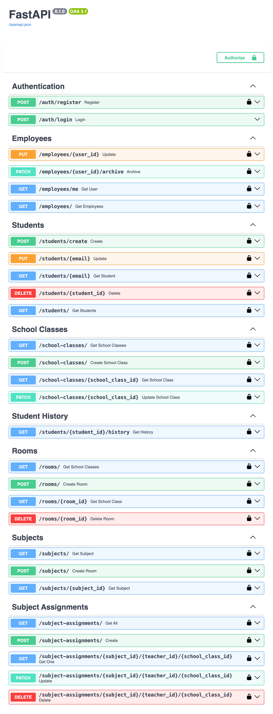

# School CMS — Backend

A backend system for managing the core operations of a school: users, employees, students, teachers, classes, subjects, rooms, and academic history.

Built as a real-world backend project with a focus on clean architecture, authentication, authorization, relational data modeling, and maintainable API design.



---

## 🚀 Overview

School CMS is a backend for a school management system designed around real academic relationships rather than simple CRUD operations.

The system currently supports:

- 🔐 JWT authentication
- 👥 User & employee management
- 🎓 Students
- 👨‍🏫 Teachers
- 🏫 School classes & class groups
- 📚 Subjects
- 🧑‍🏫 Subject assignments
- 🏠 Rooms
- 📖 Student academic history
- 🛡️ Role-based authorization
- 🗄️ PostgreSQL database
- 🔄 Alembic database migrations
- 📑 Interactive Swagger/OpenAPI documentation

The current version represents the **Backend MVP**.

---

## 🧱 Tech Stack

| Technology | Purpose |
|---|---|
| **Python** | Backend language |
| **FastAPI** | REST API framework |
| **SQLAlchemy** | ORM & database access |
| **PostgreSQL** | Relational database |
| **Alembic** | Database migrations |
| **Pydantic** | Validation & API schemas |
| **JWT** | Authentication |
| **Argon2** | Password hashing |
| **Swagger / OpenAPI** | API documentation & testing |

---

## 🏗️ Architecture

The project follows a layered structure:

```text
API
 ↓
Services
 ↓
Repositories
 ↓
SQLAlchemy Models
 ↓
PostgreSQL
```

### API

Responsible for:

- HTTP endpoints
- authentication dependencies
- authorization
- request/response handling
- HTTP errors

### Services

Contains application/business logic and coordinates operations between the API and repositories.

### Repositories

Responsible for database operations and queries.

Complex read queries also transform relational data into **human-readable API responses**, rather than exposing raw foreign-key relationships to the client.

### Models

SQLAlchemy models represent the relational database structure.

---

## 🔐 Authentication & Authorization

Authentication is handled with JWT access tokens.

Protected endpoints use the authenticated user to determine whether the request is allowed.

The backend performs authorization checks independently from the frontend.

For example:

```python
if current_user.role.name not in ["SuperAdmin", "Admin"]:
    raise HTTPException(
        status_code=403,
        detail="You do not have permission."
    )
```

The frontend can hide unavailable functionality, but the backend remains responsible for enforcing permissions.

---

## 📚 Core Domain

The system models several related academic entities:

```text
User
 ├── Employee
 │    └── Teacher
 │
 └── Role

Student
 └── StudentHistory
       └── SchoolClass
             └── ClassGroup

Teacher
 └── SubjectAssignment
       ├── Subject
       └── SchoolClass
```

This allows the system to represent relationships such as:

```text
Thomas Schmidt
      ↓
    Teacher
      ↓
    8B
      ↓
 Mathematics
```

and student progression:

```text
Student
  ↓
2023/24 → 8A
2024/25 → 9A
2025/26 → 10A
```

---

## 📡 API

The backend currently provides endpoints for:

### Authentication

```text
POST /auth/login
```

### Employees

```text
GET    /employees
GET    /employees/{user_id}
PUT    /employees/{user_id}
PATCH  /employees/{user_id}/archive
```

### Students

```text
GET    /students
GET    /students/{email}
POST   /students/create
PUT    /students/{student_id}
DELETE /students/{student_id}
```

### Student History

```text
GET /students/{student_id}/history
```

### School Classes

```text
GET   /school-classes
GET   /school-classes/{school_class_id}
POST  /school-classes
PATCH /school-classes/{school_class_id}
```

### Subject Assignments

```text
GET    /subject-assignments
GET    /subject-assignments/{subject_id}/{teacher_id}/{school_class_id}
POST   /subject-assignments
PATCH  /subject-assignments/{subject_id}/{teacher_id}/{school_class_id}
DELETE /subject-assignments/{subject_id}/{teacher_id}/{school_class_id}
```

Additional resources such as subjects and rooms are also implemented.

---

## 🖥️ API Documentation

FastAPI automatically provides interactive API documentation.

After starting the application:

```text
http://localhost:8000/docs
```

Swagger allows the entire backend to be explored and tested directly from the browser.

---

## ⚙️ Running Locally

Clone the repository:

```bash
git clone <repository-url>
cd school-cms-backend
```

Create a virtual environment:

```bash
python -m venv .venv
source .venv/bin/activate
```

Install dependencies:

```bash
pip install -r requirements.txt
```

Configure the environment variables:

```env
DATABASE_URL=postgresql://...
SECRET_KEY=...
ALGORITHM=HS256
ACCESS_TOKEN_EXPIRE_MINUTES=30
```

Run database migrations:

```bash
alembic upgrade head
```

Start the API:

```bash
uvicorn app.main:app --reload
```

Open Swagger:

```text
http://localhost:8000/docs
```

---

## 🗺️ Project Status

### Backend MVP

- [x] Authentication
- [x] JWT authorization
- [x] Role-based permissions
- [x] User management
- [x] Employee management
- [x] Student management
- [x] Teacher management
- [x] School classes
- [x] Class groups
- [x] Student history
- [x] Subjects
- [x] Rooms
- [x] Subject assignments
- [x] Database migrations
- [x] Swagger/OpenAPI documentation

### Next

- [ ] Frontend application
- [ ] Dashboard
- [ ] Timetable management
- [ ] Grades / marks
- [ ] Attendance
- [ ] Additional school workflows
- [ ] Production deployment

---

## 🎯 Why I Built It

This project is being developed as a full school-management system rather than a collection of tutorial CRUD endpoints.

The goal is to model realistic relationships between students, teachers, classes, subjects, and academic history while keeping the backend maintainable as the system grows.

The backend MVP is the foundation for the next stage: building the actual user interface and testing the system through real workflows.

---

## 📸 API Preview


---

## 🛠️ Current Status

**Backend MVP — completed**

The API is ready for frontend integration and further feature development.

---

Built with Python, FastAPI, PostgreSQL and a lot of SQLAlchemy debugging.
